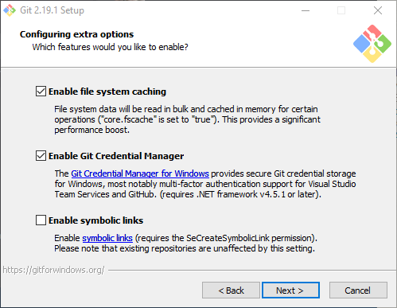

## Uploading to GitHub

## Table of Contents
- Section 1: Installation

- Section 2: First time setup

- Section 3: Updating the repository

### Section 1: Installation

#### Installing a GUI for GIT

tl;dr: Keep all defaults and click next through everything.

1. Visit ```https://git-scm.com/downloads``` and download the intaller for your operating system.
2. Once downloaded, run the installer.
3. At the license, click next.

  

4. Leave the install location as the default and click next.  

  

5. Leave the components as the default and click next.

  

6. Leave the start menu folder as the default and click next.

  

7. Leave the default editor as the default and click next.

  

8. Leave the PATH environment as the default and click next.

  

9. Leave the SSH executable as the default and click next.

  

10. Leave the HTTPS transport backend as the default and click next.

  

11. Leave the line ending conversions as default and click next.

  

12. Leave the terminal emulator as default and click next.

  

13. Leave the extra options as default and click next.

  

14. Leave the experimental options as default and click install.

  

### Section 2: First time setup

#### Adding a repository to your local machine (Cloning)

There are two methods to clone a GitHub repository to your local machine.

Note: This only needs to be done once.

##### Method 1: With the GUI

1. Open an explorer to the location where you want to create your local copy of the GitHub repository.

  

2. Right click on the whitespace and click ```Git GUI Here```

  

3. Click ```Clone Existing Repository```

  

4. For the source location copy and paste the "top level" of the GitHub repository ```https://github.com/CSUN-Irrigation/software-irrigation```
5. For the target directory copy and paste the location where you want the repository to be copied to on your local machine. Mine was ```D:\Work\Google Drive\CSUN\Fall 2018\CIT 480\CIT 480 Final Project\software-irrigation```

  Note: Unlike the method using CLI, here you should include the folder name that's the same as the repository name. (software-irrigation)
6. Press ```Clone```

  

##### Method 2: With CLI

1. Open an explorer to the location where you want to create your local copy of the GitHub repository.

  

2. Right click on the whitespace and click ```Git Bash Here```

  

3. Type ```git clone https://github.com/CSUN-Irrigation/software-irrigation``` and press enter.

  


  Hint:

  ```
  You can right click and press paste to paste long links.
  ```

  Warning:

  ```
  You have to give the link to the "top level" of a GitHub repository.
  ```

  Example:

  ```
  ```https://github.com/CSUN-Irrigation/software-irrigation``` is acceptable.

  ```https://github.com/CSUN-Irrigation/software-irrigation/tree/master/app``` is NOT acceptable.
  ```

4. The repository with the name ```software-irrigation``` should now be a folder in the directory you right clicked and opened the git CLI from.

  

### Section 3: Updating the repository
